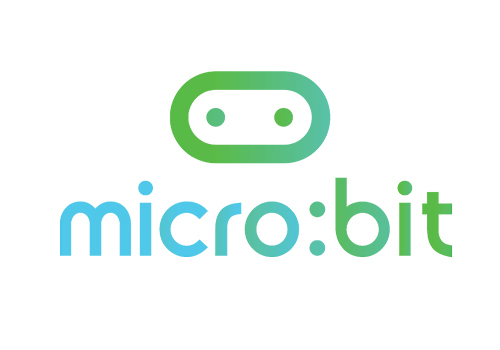
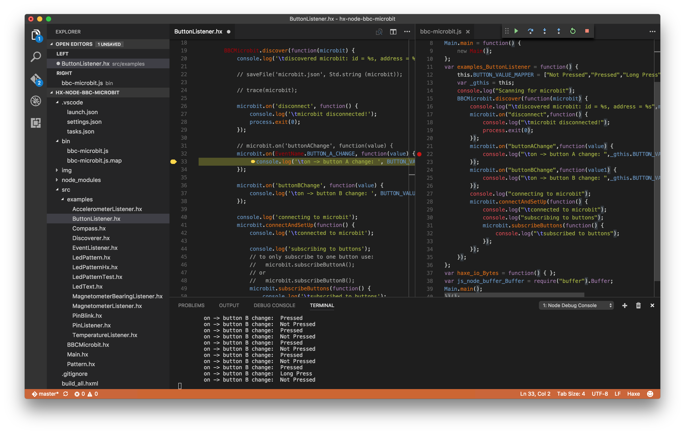
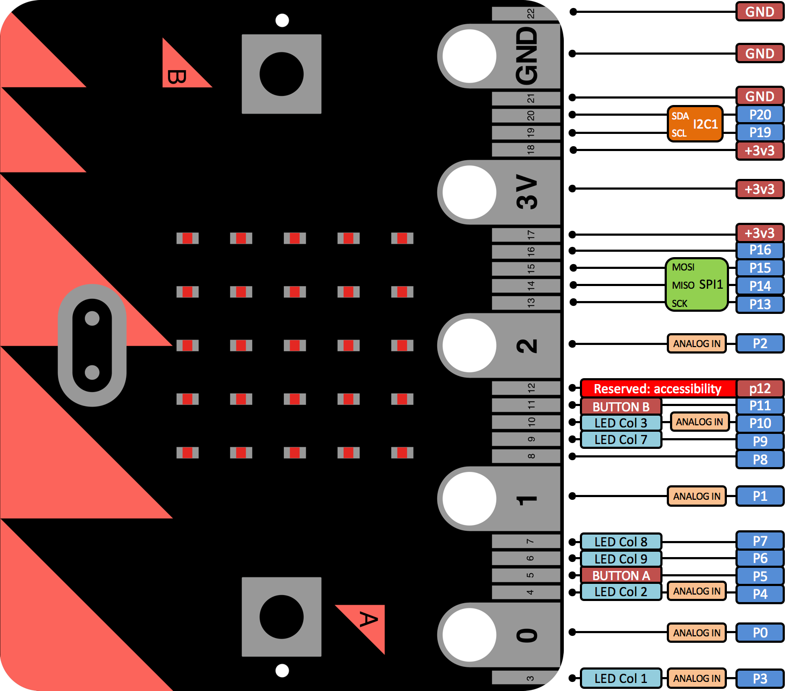

# hx-node-bbc-microbit

- [Micro:bit](#hx-node-bbc-microbit)
- [Haxe](#haxe)
- [Installation](#installation-haxenpm)
- [Haxelib](#haxelib)
- [Visual Studio Code](#visual-studio-code)
- [Haxe niceties](#haxe-niceties)
- [Difference](#difference)
- [Examples](#examples)




> The Micro Bit (also referred to as BBC Micro Bit, stylized as micro:bit) is an ARM-based embedded system designed by the BBC for use in computer education in the UK.
>
> The board is 4 cm × 5 cm and has an ARM Cortex-M0 processor, accelerometer and magnetometer sensors, Bluetooth and USB connectivity, a display consisting of 25 LEDs, two programmable buttons, and can be powered by either USB or an external battery pack.[2] The device inputs and outputs are through five ring connectors that are part of the 23-pin edge connector.
>
> [wikipedia](https://en.wikipedia.org/wiki/Micro_Bit)


Control a [BBC micro:bit](http://microbit.org/) from Node.js using BLE and [Haxe](http://haxe.org/)

These are the Haxe node.js externs from <https://github.com/sandeepmistry/node-bbc-microbit> and follows the [api](https://github.com/sandeepmistry/node-bbc-microbit/blob/master/API.md)


## Haxe?

Read more about [Haxe](README_HAXE.MD)


## Installation Haxe/NPM

#### 1. [follow instructions to install `bbc-microbit`](https://github.com/sandeepmistry/node-bbc-microbit#prerequisites)
> Make sure to follow the instructions for `noble` too.

#### 2. install dependencies with npm
```
npm install
```

#### 3. install haxelib

```
haxelib git bbc-microbit https://github.com/MatthijsKamstra/hx-node-bbc-microbit
```


## Haxelib

use this repo locally

```
haxelib dev bbc-microbit path/to/folder/src
```

or this git repo

```
haxelib git bbc-microbit https://github.com/MatthijsKamstra/hx-node-bbc-microbit
```

don't forget to add it to your build file

```
-lib bbc-microbit
```

# Visual Studio Code

I would suggest to us Visual Studio Code, it's a very nice editor and lets you set breakpoints in your `js` file





## Haxe niceties

create a (LED)pattern from an array

```haxe
var X = [
	1, 0, 0, 0, 1,
	0, 1, 0, 1, 0,
	0, 0, 1, 0, 0,
	0, 1, 0, 1, 0,
	1, 0, 0, 0, 1,
];
var buffer = new Buffer(new Pattern().createLedMatrixBuffer(X));

// follow example "LedPatternHx"
// or use a default Pattern
var buffer = new Buffer(new Pattern().createLedMatrixBuffer(Pattern.HEART));


```

Use string to listen to or `EventName`

```haxe
import BBCMicrobit;

// strings will work
microbit.on('buttonAChange', function(value) {
	console.log('\ton -> button A change');
});

// prevent spelling mistakes with EventName
microbit.on(EventName.BUTTON_A_CHANGE, function(value) {
	console.log('\ton -> button A change');
});
```

Use the fixed values for AccelerometerPeriod `Period`

```haxe
import BBCMicrobit;

// numbers will work
microbit.writeAccelerometerPeriod(160, function(eror) {
	console.log('\taccelerometer period set');
});

// prevent using wrong value use Period
microbit.writeAccelerometerPeriod(Period.NR_160, function(eror) {
	console.log('\taccelerometer period set');
});
```

## Difference

- UART doesn't work: [check api](https://github.com/sandeepmistry/node-bbc-microbit/blob/master/API.md#uart)
- EventListeners examples doesn't work: the code is not uploaded to NPM yet
- Light sensor doesn't work: it works with a trick [read more](https://lancaster-university.github.io/microbit-docs/extras/light-sensing/)
- The code is not written on the micro:bit, remove power (switch off) and the code is gone
-


## Examples

most examples from <https://github.com/sandeepmistry/node-bbc-microbit> are "redone" in Haxe

- [AccelerometerListener.hx](/src/examples/AccelerometerListener.hx)
- [ButtonListener.hx](/src/examples/ButtonListener.hx)
- [Compass.hx](/src/examples/Compass.hx)
- [Discoverer.hx](/src/examples/Discoverer.hx)
- [EventListener.hx](/src/examples/EventListener.hx) // doesn't work
- [LedPattern.hx](/src/examples/LedPattern.hx)
- [LedPatternHx.hx](/src/examples/LedPatternHx.hx)
- [LedPatternTest.hx](/src/examples/LedPatternTest.hx)
- [LedText.hx](/src/examples/LedText.hx)
- [MagnetometerBearingListener.hx](/src/examples/MagnetometerBearingListener.hx)
- [MagnetometerListener.hx](/src/examples/MagnetometerListener.hx)
- [PinBlink.hx](/src/examples/PinBlink.hx)
- [PinListener.hx](/src/examples/PinListener.hx)
- [TemperatureListener.hx](/src/examples/TemperatureListener.hx)

## Blink




## Source

- <https://microbit-playground.co.uk/howto/microbit-blink-led-example>
- <http://www.microbitlearning.com/page/5>
- <http://www.makerspace-uk.co.uk/a-selection-of-microbit-projects/>
- <https://learn.adafruit.com/adafruit-arduino-lesson-2-leds/resistors>
- <https://www.kitronik.co.uk/blog/bbc-microbit-kitronik-university/>